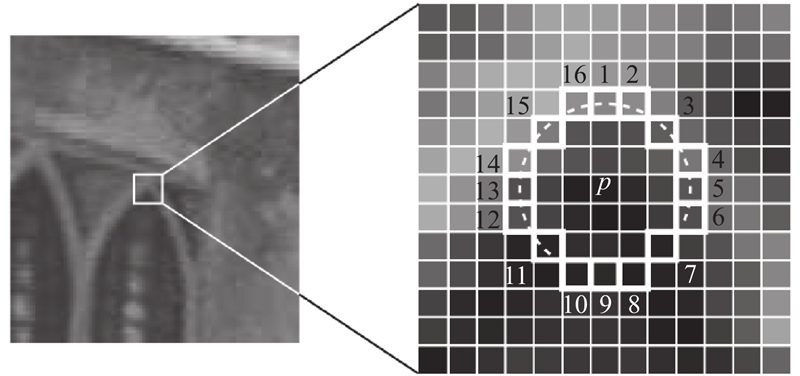

## Fast corner detection
### 原理
#### 角点检测
- 使用圆形模板，通过模板中心的像素与模板上的像素的偏离程度来判断该点是否为角点
对于中心位置的像素，取半径为3的圆，圆会经过16个像素，这16个像素的坐标记录为row_coord_on_circle，col_coord_on_circle。

设置阈值threshold，如果圆周上16个像素点中有连续N个点，其**像素值与中心位置的像素值之差大于threshold（或小于-threshold）**，则认为该中心点为角点
条件1：像素值与中心位置的像素值之差大于threshold
条件2：像素值与中心位置的像素值之差小于-threshold
这里N一般选择12，但当N=9时，往往能取得更好的效果。在代码中我们选择N=9。
**N = 12** ：在计算中心点是否为角点时，为了加快速度，我们可以先判断 1 号、5 号、9 号、13 号像素点是否满足条件，这四个点必须至少有三个点满足两个条件之一才能将中心点定义为角点
**N = 9** ：1 号、9 号必须至少有一个点满足条件 1 或条件 2 ，同时 5 号、13 号必须至少有一个点满足条件 1 或条件 2

这样我们就筛选出了图片中的角点，但此时检测出的角点很多，会出现角点相邻、小区域内有多个角点特征的情况。
#### 非极大值抑制去除多余角点
此时我们计算每个角点的得分（score），即圆周上16个像素点的值与中心点像素值的差的绝对值之和。
获得每个角点的score后，在 3 * 3 / 5 * 5的区域内，我们利用非极大值抑制去除区域内得分较低的点。
代码中 nms 方法写的相对比较简单，可以进一步优化，实现更高精度的筛选

#### 其他

FAST还有很多有待改进的地方，可以看出，这份代码的检测效果并不是特别好，问题可能是出在非极大值抑制的部分，也许是因为它抑制的范围较小，使得它并不能很好地将该去除的角点删除，导致角点几乎变成“边缘”。
另外，我们可以通过调节threshold的值来更精确的识别出角点。
现在也有提出根据机器学习来改进FAST的方法，可以进一步学习。

