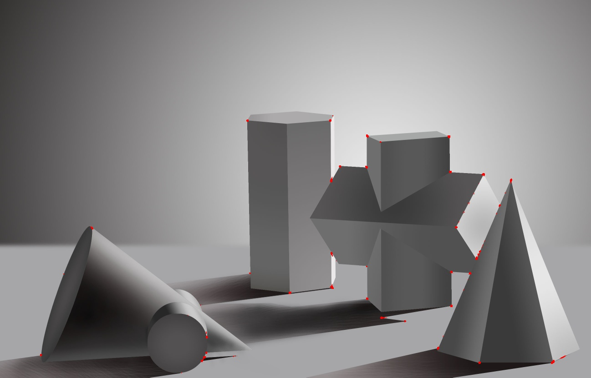

# Corner detection
Different methods for corner detection in image processing

## 1. [Harris corner detection](harris/harris_doc/README.md)
&emsp;&emsp;利用Harris实现角点检测，具体代码和原理点击标题查看

输入：

输出：

## 2. [FAST corner detection](FAST/fast_doc/README.md)
&emsp;&emsp;利用FAST (Features from Accelerated Segment Test)实现角点检测，具体代码和原理点击标题查看
