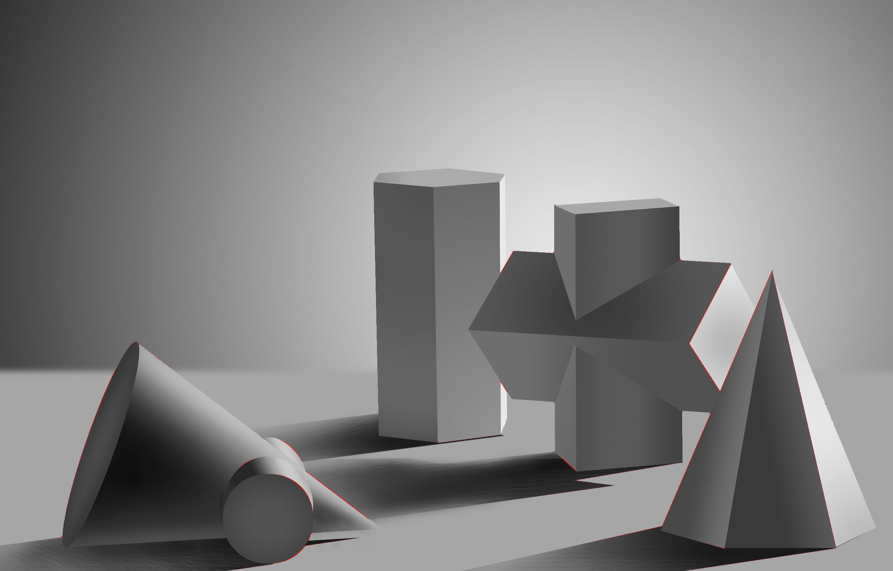

# Corner detection
Different methods for corner detection in image processing

## 1. [Harris corner detection](harris/harris_doc/README.md)
利用Harris实现角点检测，具体代码和原理点击标题查看

输入 -> 输出：

 

## 2. [FAST corner detection](FAST/fast_doc/README.md)
利用FAST（Features from Accelerated Segment Test）实现角点检测，具体代码和原理点击标题查看

输入 -> 输出 -> 非极大值抑制

 

 

 

Harris中的的每个角点由较多像素组成，因此清晰可见，而FAST检测出的角点由较少像素组成，角点较小，图片放大后才能看见，经过对比，可以看到FAST检测出的结果并没有Harris那么精确，它保留了很多不该保留的检测角点，且有许多角点并未识别出

