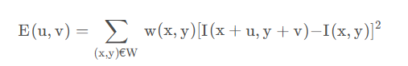
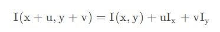
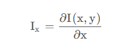
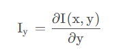
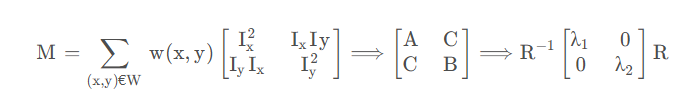
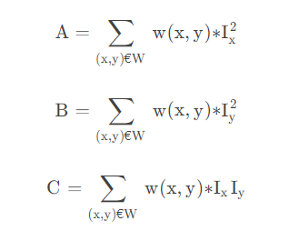
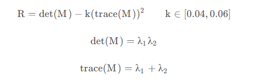

## Harris corner detection
### 灰度变化公式

[u, v] 窗口偏移量 
[x, y] 滑动窗口所在位置坐标 
I(x, y) 坐标为(x, y)的像素灰度值 
I(x+u, y+v) 坐标为(x+u, y+v)的像素灰度值 
w(x, y) 窗口函数，最简单的情况是窗口内所有像素的权重系数设为1，通常我们使用二维高斯分布作为窗口函数，这样，当窗口中心点为角点时，窗口移动前后，该点的灰度变化贡献最大

### 灰度变化公式的化简
根据二维泰勒公式：

.png)

我们可以将 $I(x+u, y+v)$ 写成：

其中

   

由此，可以将灰度变化公式E(u, v)化简：

1.png)

2.png)

其中：

我们可以把$E(u, v)$写成：

3.png)

其中A，B，C是指：

此时，E(u, v) 是一个二次项函数，二次项函数的本质是椭圆函数

>如果M中两个特征值都比较大，且两个特征值大小相当，说明窗口在所有方向上移动都会引起灰度的明显变化，则这个点是角点
>如果M中两个特征值都很小，则这个区域灰度变化不大
>如果M中只有一个特征值比较大，说明窗口在某个方向移动时会引起灰度的明显变化，这里是个边缘

### 角点响应函数R

定义角点响应函数R来判定窗口内是否包含角点，根据需求定义一个阈值threshold，当R>threshold时，我们认为窗口内存在角点，这里给出一种角点响应函数的计算作为示例：

其中k是一个自定义值，一般根据实验确定它的大小，一般在0.04~0.06之间，当k的值增大时，角点检测的灵敏度降低，减少被检测角点的数量，后面还可以根据需要在图像区域内进行角点的非极大值抑制
